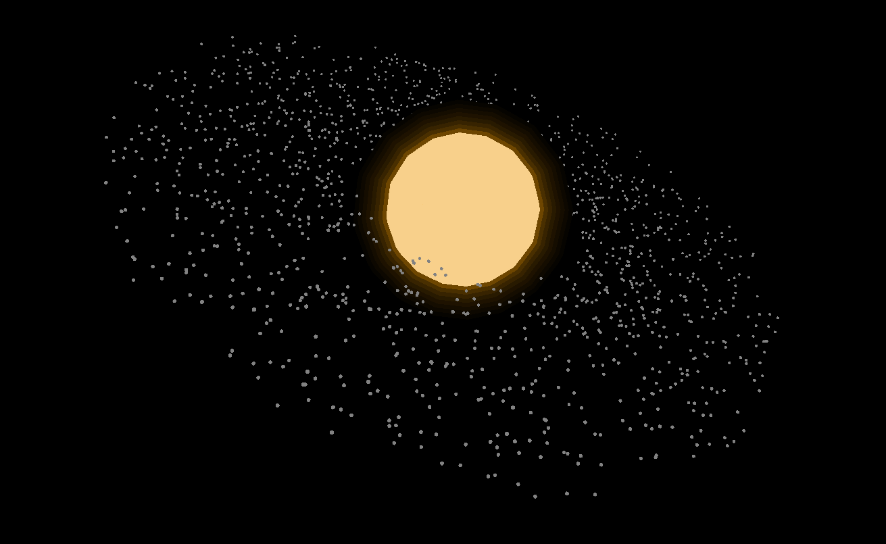
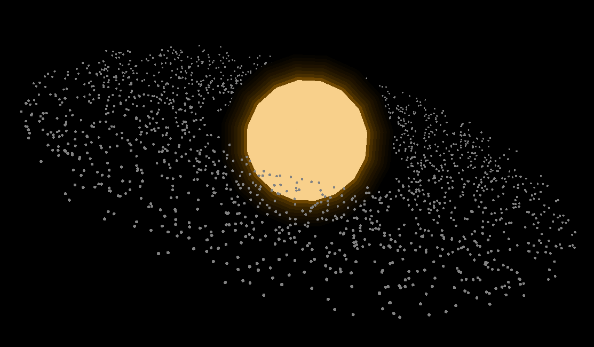
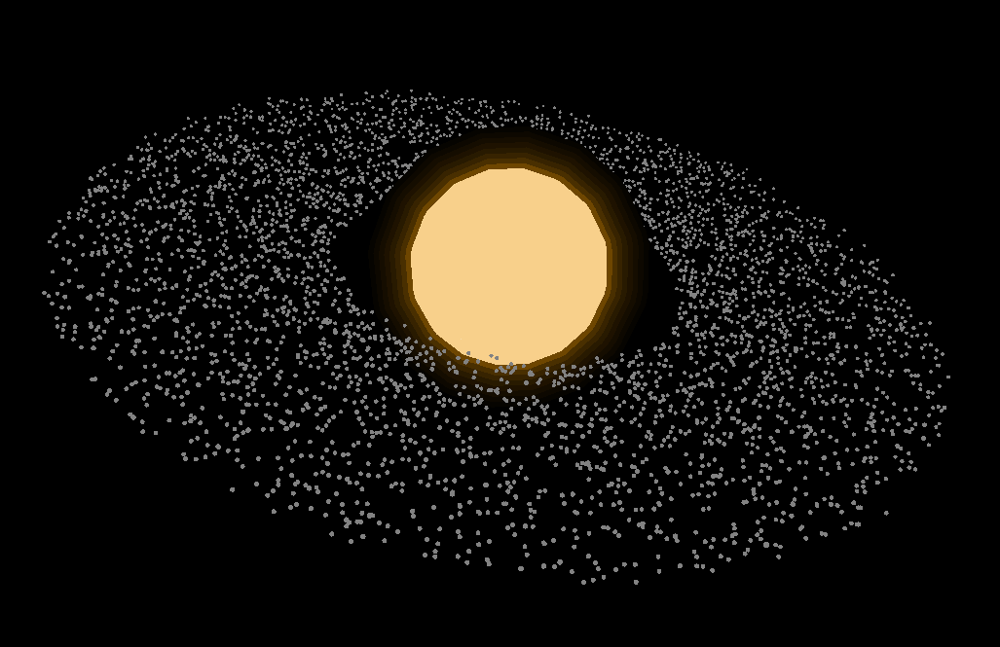

# Planetary Accretion Disk Simulation
This project simulates accretion disk phenomena - dust and gas orbiting a star to form a disk structure. The simulation involves the physics of gravity, inelastic collisions, the Barnes-Hut algorithm for optimization, and the Raylib library for visualization.

## Barnes-Hut Overview
Instead of calculating gravity between every individual pair of particles (O(N^2)), the Barnes-Hut algorithm groups distant particles into a tree structure (O(N log N)).
- Particles are inserted into a QuadTree (2D) or OctTree (3D).
- Each node in the tree stores the total mass and the center of mass of all particles within it.
- If a node is far enough from a particle (controlled by the THETA ratio), the entire node is treated as a single large particle for gravity calculation.
- A smaller THETA increases accuracy, while a larger THETA increases performance.

## Optimization Tweaks
- **Node Pooling**: Tree nodes are pre-allocated in a static pool. This avoids the overhead of memory allocation (`new`) and deallocation (`delete`) every frame.
- **Squared Distance**: The THETA check and gravitational force calculations use squared distances ($s^2 < \theta^2 \cdot d^2$) to avoid expensive `sqrt()` calls during tree traversal.
- **Parallel Execution**: Particle position and velocity updates are processed in parallel using C++17 execution policies to utilize multiple CPU cores.
- **Velocity Verlet**: Uses a two-step integration method to maintain energy conservation and orbital stability better than standard Euler integration.

## Build and Run
- Requires **Raylib** and a **C++17** compatible compiler.
- Run `make main` to compile the simulation.
- Run `./main` to start.

## Demo
_My laptop is Thinkpad X1 Gen 9 with no GPU, so the performance is limited by CPU._

_1500 particles simulation_

_2000 particels simulation_
These simulation achieve around 10+ FPS

This simulation achieves around 5+ FPS, which is quite good considering the computational load of simulating 5000 particles with the Barnes-Hut algorithm on a CPU without GPU acceleration.

I don't know if the results are good or not, but I think it's pretty good for a CPU-based simulation. Right now, it just runable on my laptop, and I haven't tested it on other machines. 

